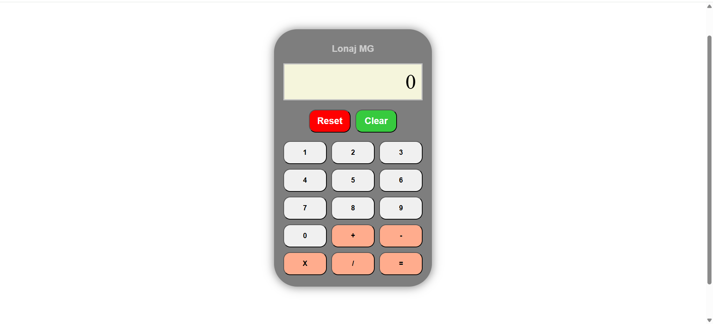

# 🧮 Calculatrice JavaScript



Une calculatrice web responsive avec des fonctions basiques, développée en HTML, CSS et JavaScript.

## ✨ Fonctionnalités

- Opérations basiques : addition, soustraction, multiplication, division
- Bouton Clear (C) pour effacer la dernière entrée
- Reset (AC) pour tout effacer
- Design moderne et responsive
- Gestion des erreurs (division par zéro, etc.)

## 🚀 Comment l'utiliser

1. Clonez le dépôt :
```bash
git clone https://github.com/Tony501/Calculator
